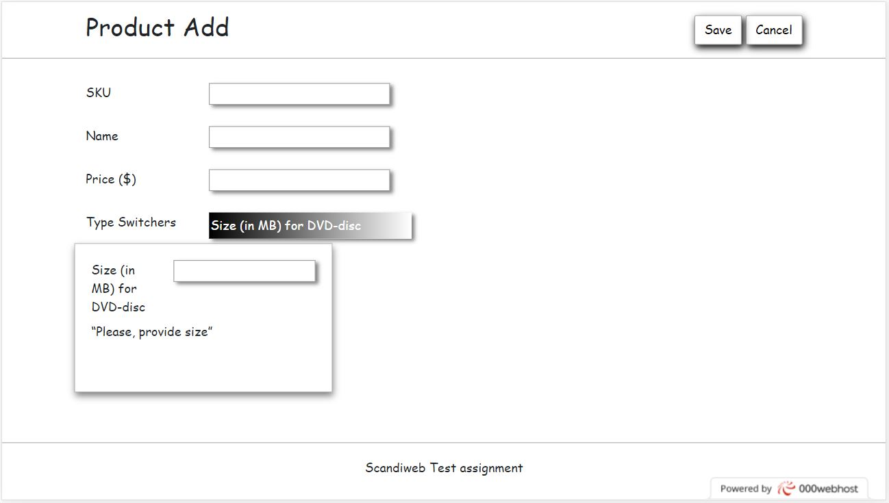

# AddingAProduct_project_PHP

Adding a product page created with HTML, CSS, Javascript, Jquery and PHP.

Here I saved the Adding a product PHP project, realized during my Backend Development course, using PHP programming language and MySQL Database Service, and Workbench to manage data and database structures.
Features Adding-a-product-page: Filling Form, Add Product(with Add button to send products in database), Cancel Button to move in product-list-page and reset input values.
Features Product-list-page: Delete Post (with MassDelete Button to send a request to remove products from database).

https://angeloalbertomnt.000webhostapp.com/public/adding-a-product-page.php

 
